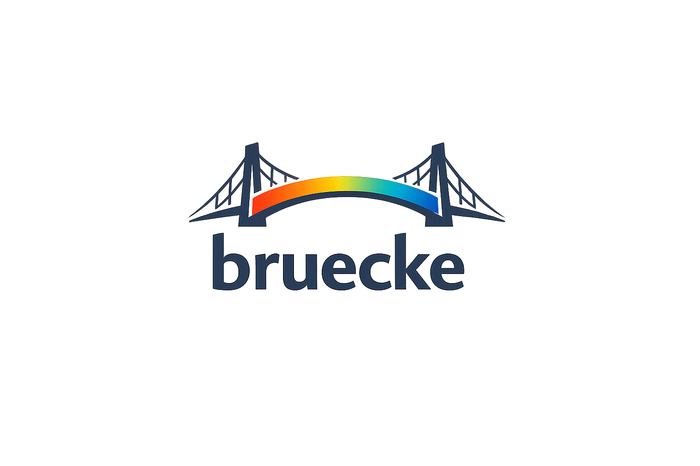
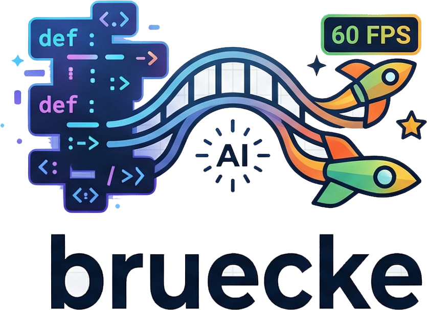

# bruecke

<div align="center">
  
</div>

<div align="center">

**[🌐 levogne.github.io/bruecke](https://levogne.github.io/bruecke/)** &nbsp;|&nbsp;
**[📖 Docs](COMMANDS.md)** &nbsp;|&nbsp;
**[⬇ Releases](https://github.com/LEVOGNE/bruecke/releases)**

</div>

### The fastest path from idea to running 2D prototype — locally, with AI, at 60 fps.

> **Describe a system in plain language. Watch it run in seconds.**
> Python · AI · WebAssembly · WebGPU — no install, no build step, no cloud.

---

<!-- Language Navigation -->
<div align="center">

[🇬🇧 English](#english) &nbsp;|&nbsp;
[🇩🇪 Deutsch](#deutsch) &nbsp;|&nbsp;
[🇹🇷 Türkçe](#turkce) &nbsp;|&nbsp;
[🇪🇸 Español](#espanol) &nbsp;|&nbsp;
[🇫🇷 Français](#francais) &nbsp;|&nbsp;
[🇸🇦 العربية](#arabic) &nbsp;|&nbsp;
[🇨🇳 中文](#chinese)

</div>

---

<a id="english"></a>
## 🇬🇧 English

<div align="center">
  
</div>

**bruecke** (German for *bridge*) is an AI-native local runtime for 2D prototypes. You describe what you want. The AI writes Python. The engine runs it — compiled to WebAssembly, rendered by WebGPU at 60 fps, hot-reloaded in milliseconds. No page reload. No compiler. No waiting. No cloud.

> **Who it is for:** developers, designers, educators, and creative coders who want to go from idea to running visual prototype as fast as physically possible — without touching a build system.

---

### 🆚 How bruecke compares

| | **bruecke** | Pyodide | PyScript | p5.js / Processing |
|---|---|---|---|---|
| **Runtime** | RustPython → WASM | CPython → WASM | CPython → WASM | JavaScript |
| **Rendering** | WebGPU (GPU, 60 fps) | Canvas 2D / DOM | Canvas 2D / DOM | Canvas 2D |
| **Hot-reload** | ✅ instant (file save) | ❌ manual | ❌ manual | partial |
| **AI loop built-in** | ✅ prompt → runs live | ❌ | ❌ | ❌ |
| **Local-first** | ✅ offline binary | ⚠️ CDN-first | ⚠️ CDN-first | ⚠️ CDN-first |
| **No build step** | ✅ | ⚠️ needs setup | ⚠️ needs setup | ✅ |
| **SVG sprites** | ✅ GPU-rasterised | manual | manual | ❌ |
| **Persistent storage** | ✅ built-in | manual | manual | manual |
| **pip packages** | ❌ pure stdlib only | ✅ many | ✅ many | N/A |
| **Ideal for** | **AI-driven prototyping, games, sims, generative art** | data science, notebooks | general Python in browser | creative coding education |

**bruecke is not a replacement for Pyodide or PyScript** — those support the full PyPI ecosystem and are better for data science and general web Python. bruecke is purpose-built for one thing: the shortest possible loop between *idea* and *running visual prototype*.

---

### 🚀 Start in 30 seconds

```bash
cd dist && ./server     # macOS / Linux
cd dist && server.exe   # Windows
```

Open **http://127.0.0.1:7777** — edit `app.py` — the canvas updates instantly on every save.

> The entire application is three files: `server` (binary), `bruecke_bg.wasm` (~5 MB), `app.py`.

---

### 🎮 What you can build

| Category | Examples |
|----------|---------|
| **Games** | Platformers with gravity & collision · shooters · puzzle games · RPGs |
| **Simulations** | Physics sandboxes · particle systems · cellular automata · flocking |
| **Generative art** | Algorithmic animation · procedural patterns · emergent visuals |
| **Data viz** | Real-time charts · force graphs · live dashboards |
| **Tools** | Algorithm visualisations · sorting · pathfinding demos |
| **Performances** | Music-reactive visuals · interactive installations |

---

### 🤖 AI Prompt → Describe it. See it. Right now.

> Type anything in natural language. The AI writes the Python. bruecke runs it — live at 60 fps, no build step, no waiting.

```
"a knight hero with gravity and jumping, use SVG sprites"
"solar system with realistic orbits, add a comet on click"
"Conway's Game of Life, neon colors, mouse draws live cells"
```

The AI **always outputs Python code** — never text, never markdown. The output is validated as valid Python syntax before it ever touches `app.py`. If validation fails, the running scene is left untouched.

#### ✨ AI Features

| Feature | How |
|---------|-----|
| **🔑 Three providers** | Anthropic Claude · OpenAI GPT-4o · Google Gemini (free tier!) |
| **📐 Build On** | Tick *build on* → AI extends existing code instead of rewriting |
| **📜 Version History** | Every generation saved automatically — click 📜 to restore any version |
| **🛡️ Safe validation** | Python syntax check before writing — bad AI output never crashes your scene |

```bash
# Set your key before starting (or enter it in the browser UI via 🔑)
export ANTHROPIC_API_KEY=sk-ant-...   # Claude — smartest
export GEMINI_API_KEY=AIza...         # Gemini — free tier!
export OPENAI_API_KEY=sk-...          # GPT-4o
cd dist && ./server
```

#### 🔌 API Mode — headless / remote control

```
bruecke  Start with AI prompter? [Y/n]: n
```

Control bruecke from any script, CI pipeline, or external tool:

```bash
# Push Python code — browser hot-reloads instantly
curl -X POST http://127.0.0.1:7777/run -d @app.py

# Natural language prompt → AI generates → runs
curl -X POST http://127.0.0.1:7777/prompt \
  -H "Content-Type: application/json" \
  -d '{"prompt": "rotating rainbow spiral", "provider": "anthropic"}'

# Extend existing code instead of rewriting
curl -X POST http://127.0.0.1:7777/prompt \
  -H "Content-Type: application/json" \
  -d '{"prompt": "add bouncing enemies", "provider": "anthropic", "build_on": true}'
```

---

### 🖼️ SVG Sprites & Images

Drop any image file next to `app.py` and use it immediately — PNG, JPG, GIF, WebP, and **SVG** all work. No asset pipeline. No texture atlases to configure. Just files.

```python
# Any image format — loaded and cached automatically
image("hero.svg",       x, y, 96, 96)            # SVG sprite
image("background.png", 0, 0, 800, 600)          # full-screen background
image("tileset.png",    x, y, 32, 32,             # sprite sheet — crop a tile
      sx=64, sy=0, sw=32, sh=32)
image("hero.svg",       x, y, -96, 96)           # negative width = flip horizontally
image("sword.svg",      x, y, 48, 48, angle=45)  # rotate in degrees
```

**SVG sprites** are rasterised by the browser at the exact pixel size you request — no blurriness at any scale, no pixel art limitations. Draw your assets in Inkscape, Figma, or Illustrator and drop the `.svg` next to `app.py`.

**Animated sprites** — use multiple SVG files for animation frames:

```python
import math

# Walk cycle: hero_01.svg, hero_02.svg, ... hero_06.svg
frame_idx = int(t * 10) % 6 + 1
image(f"hero_0{frame_idx}.svg", x, y, 96, 96)

# Jump / fall frames
if not on_ground:
    img = "hero_jump.svg" if vy < 0 else "hero_fall.svg"
    image(img, x, y, 96, 96)
```

---

### 🐍 100% Standard Python — zero learning curve

**bruecke runs real Python 3.** No custom syntax. No special API to learn. If you know Python, you already know bruecke.

```python
import math
import random

GRAVITY = 0.45
FLOOR   = 560

# Module-level code runs once — perfect for game state
class Hero:
    def __init__(self):
        self.x, self.y = 400, FLOOR
        self.vx, self.vy = 0.0, 0.0
        self.on_ground = True

hero = Hero()
coins = [(random.randint(50, 750), random.randint(100, 500)) for _ in range(10)]

def frame(t):
    global coins

    # ── physics ──────────────────────────────────────────────────────────────
    hero.vy += GRAVITY
    if keys & 16 and hero.on_ground:   # space = jump
        hero.vy = -11.0; hero.on_ground = False
    if keys & 1: hero.vx = -3.5
    if keys & 2: hero.vx =  3.5
    if not (keys & 3): hero.vx *= 0.8

    hero.x += hero.vx
    hero.y += hero.vy
    if hero.y >= FLOOR:
        hero.y = FLOOR; hero.vy = 0; hero.on_ground = True

    hero.x = clamp(hero.x, 48, 752)

    # ── collect coins ────────────────────────────────────────────────────────
    coins = [c for c in coins
             if math.hypot(c[0] - hero.x, c[1] - hero.y) > 30]

    # ── draw ─────────────────────────────────────────────────────────────────
    color(10, 15, 35); rect(0, 0, 800, 600)        # sky
    color(40, 120, 40); rect(0, FLOOR, 800, 600)   # ground

    color(255, 220, 50)
    for cx, cy in coins:
        circle(cx, cy, 10)

    image("hero.svg", hero.x - 48, hero.y - 96, 96, 96)
```

#### Standard imports

```python
import math
from math import sin, cos, pi, atan2, sqrt, log, exp, hypot, floor, ceil, radians, degrees

import random
from random import randint, choice, shuffle, uniform, sample
```

| Module | Available |
|--------|-----------|
| `math` | `sin cos tan sqrt floor ceil fabs atan2 hypot log log2 log10 exp pow radians degrees pi e tau inf isfinite isinf isnan` |
| `random` | `random randint choice shuffle uniform sample seed` |

Extra builtins (no import needed): `lerp(a, b, t)` · `clamp(x, lo, hi)` · `sign(x)`

#### Local modules — your own .py libraries

Drop any `.py` file next to `app.py` and import it. The server bundles it automatically — no pip, no virtualenv:

```
dist/
  app.py        ← main script
  physics.py    ← your physics engine
  enemies.py    ← enemy AI
  hero.svg      ← sprite
  coin.svg      ← sprite
```

```python
import physics
import enemies
```

#### Full API reference

> 📖 **[Full Command Lexicon](COMMANDS.md)** — every function, global, and module with examples.

**Draw**

| Function | Description |
|----------|-------------|
| `color(r, g, b)` | Fill color — 0–255 per channel |
| `alpha(a)` | Opacity — 0.0 to 1.0 |
| `rect(x, y, w, h)` | Filled rectangle |
| `circle(x, y, r)` | Filled circle (64 segments) |
| `line(x1, y1, x2, y2)` | Line, 3px wide |
| `image(url, x, y, w, h, sx=0, sy=0, sw=-1, sh=-1, angle=0)` | Image or SVG sprite. Negative `w` flips horizontally. `sx/sy/sw/sh` crop a sprite sheet. `angle` rotates in degrees. |

**Globals (injected every frame — read only)**

| Name | Description |
|------|-------------|
| `t` | Seconds since start |
| `mouse_x`, `mouse_y` | Cursor position (0–800, 0–600) |
| `mouse_btn` | Button bitmask: `1` = left held |
| `keys` | `1`=left `2`=right `4`=up `8`=down `16`=space |

---

### ⚙️ How it works

```
app.py (you edit)
   │  file save
   ▼
Rust server (Axum + notify)
   │  SSE push (instant)
   ▼
Browser
   ├─ RustPython WASM  →  compiles + runs Python
   ├─ Draw API         →  vertex buffer
   └─ WebGPU           →  GPU render, MSAA 4x, 60 fps
```

1. Save `app.py` — file watcher fires in milliseconds (survives atomic saves from VS Code / Vim)
2. Server pushes full source over **Server-Sent Events**
3. **RustPython** (Python 3 compiled to WASM) compiles and runs your script in the browser
4. `frame(t)` is called 60× per second — draw calls fill a vertex buffer
5. **WebGPU** uploads vertices to the GPU and renders with MSAA 4×
6. Error? Red overlay appears, last good frame stays — fix and save to clear

Everything runs **locally**. No cloud. No account. No internet required after setup.

---

### 🏗️ Build from source

| Tool | Install |
|------|---------|
| Rust + Cargo | [rustup.rs](https://rustup.rs) |
| wasm-pack | `cargo install wasm-pack` |

```bash
./build.sh      # macOS / Linux  — full build (WASM + server)
build.bat       # Windows
```

| Step | First build | Later |
|------|------------|-------|
| WASM (`wasm-pack`) | ~5 min | ~10 s |
| Server (`cargo build`) | ~1 min | ~5 s |

### 🌐 Browser support

| Browser | Status |
|---------|--------|
| Chrome 113+ | ✅ Full support |
| Edge 113+ | ✅ Full support |
| Safari 18+ (macOS Sequoia) | ✅ Full support |
| Firefox | ⚠️ Enable flag: `dom.webgpu.enabled` |
| Mobile | ⚠️ Not yet widely supported |

### 🔩 Tech stack

| Layer | Technology |
|-------|-----------|
| Python interpreter | RustPython 0.4 — full Python 3, compiled to WASM |
| WASM bridge | wasm-bindgen — zero-overhead Rust ↔ JS |
| GPU rendering | WebGPU — MSAA 4×, explicit pipeline |
| HTTP server | Axum + Tokio — async Rust, SSE streaming |
| File watcher | notify — cross-platform, atomic-save safe |

### License

**AGPLv3** (open source) · **Commercial License** available

The core engine is released under the [GNU Affero General Public License v3.0](https://www.gnu.org/licenses/agpl-3.0.html).

**What this means:**
- ✅ Free to use, study, modify, and distribute for open-source projects
- ✅ Free for personal use, education, and non-commercial creative work
- ⚠️ If you build a network service or product on top of bruecke, your source must also be AGPL-licensed
- 💼 Need to embed bruecke in a closed-source product? A **commercial license** removes the AGPL obligations — contact for pricing.

---

<a id="deutsch"></a>
## 🇩🇪 Deutsch

<div align="center">
  
</div>

### Python · AI · WebAssembly · WebGPU

> **Beschreib ein Spiel. Drück Enter. Schau zu, wie es mit 60 fps läuft — live im Browser.**
> Kein Install. Kein Build-Schritt. Keine Cloud. Nur Python, von der GPU gerendert, sofort.

**bruecke** (Deutsch für *Brücke*) ist eine Creative-Coding-Engine, die einen vollständigen Python-3-Interpreter direkt im Browser ausführt — kompiliert zu WebAssembly, beschleunigt von WebGPU mit 60 fps. Du schreibst Python. Du speicherst die Datei. Der Canvas aktualisiert sich in Millisekunden. Kein Neuladen. Kein Compiler. Kein Warten.

---

### 🚀 In 30 Sekunden starten

```bash
cd dist && ./server     # macOS / Linux
cd dist && server.exe   # Windows
```

Öffne **http://127.0.0.1:7777** — bearbeite `app.py` — der Canvas aktualisiert sich sofort bei jedem Speichern.

> Die gesamte Anwendung besteht aus drei Dateien: `server` (Binary), `bruecke_bg.wasm` (~5 MB), `app.py`.

---

### 🎮 Was du bauen kannst

| Kategorie | Beispiele |
|-----------|-----------|
| **Spiele** | Platformer mit Gravitation & Kollision · Shooter · Puzzle-Spiele · RPGs |
| **Simulationen** | Physik-Sandboxes · Partikelsysteme · Zelluläre Automaten · Schwarmverhalten |
| **Generative Kunst** | Algorithmische Animation · Prozedurale Muster · Emergente Grafiken |
| **Daten-Viz** | Echtzeit-Diagramme · Kräfte-Graphen · Live-Dashboards |
| **Werkzeuge** | Algorithmen-Visualisierungen · Sortierung · Pfadfindungs-Demos |
| **Performances** | Musikreaktive Visuals · Interaktive Installationen |

---

### 🤖 KI-Prompt → Beschreib es. Sieh es. Sofort.

> Schreib etwas in natürlicher Sprache. Die KI schreibt das Python. bruecke führt es aus — live mit 60 fps, kein Build-Schritt, kein Warten.

```
"ein Ritter-Held mit Gravitation und Springen, SVG-Sprites"
"Sonnensystem mit realistischen Umlaufbahnen, Komet bei Klick"
"Conways Game of Life, Neon-Farben, Maus zeichnet lebende Zellen"
```

Die KI gibt **immer Python-Code aus** — niemals Text, niemals Markdown. Die Ausgabe wird als gültige Python-Syntax validiert, bevor sie `app.py` berührt. Schlägt die Validierung fehl, bleibt die laufende Szene unverändert.

#### ✨ KI-Features

| Feature | Wie |
|---------|-----|
| **🔑 Drei Anbieter** | Anthropic Claude · OpenAI GPT-4o · Google Gemini (kostenloser Tier!) |
| **📐 Aufbauend** | *Build on* aktivieren → KI erweitert bestehenden Code statt neu zu schreiben |
| **📜 Versions-History** | Jede Generierung automatisch gespeichert — 📜 klicken zum Wiederherstellen |
| **🛡️ Sichere Validierung** | Python-Syntax-Check vor dem Schreiben — schlechter KI-Output crasht nie die Szene |

```bash
# Key vor dem Start setzen (oder im Browser via 🔑 eingeben)
export ANTHROPIC_API_KEY=sk-ant-...   # Claude — schlaueste
export GEMINI_API_KEY=AIza...         # Gemini — kostenloser Tier!
export OPENAI_API_KEY=sk-...          # GPT-4o
cd dist && ./server
```

#### 🔌 API-Modus — Headless / Fernsteuerung

```
bruecke  Start with AI prompter? [Y/n]: n
```

bruecke aus jedem Skript, CI-Pipeline oder externen Tool steuern:

```bash
# Python-Code pushen — Browser hot-reloaded sofort
curl -X POST http://127.0.0.1:7777/run -d @app.py

# Natürlichsprachlicher Prompt → KI generiert → läuft
curl -X POST http://127.0.0.1:7777/prompt \
  -H "Content-Type: application/json" \
  -d '{"prompt": "rotierende Regenbogen-Spirale", "provider": "anthropic"}'

# Aufbauend auf dem aktuellen Code
curl -X POST http://127.0.0.1:7777/prompt \
  -H "Content-Type: application/json" \
  -d '{"prompt": "hüpfende Bälle hinzufügen", "provider": "anthropic", "build_on": true}'
```

---

### 🖼️ SVG-Sprites & Bilder

Lege eine Bilddatei neben `app.py` und benutze sie sofort — PNG, JPG, GIF, WebP und **SVG** funktionieren alle. Keine Asset-Pipeline. Keine Texture-Atlanten. Einfach Dateien.

```python
# Jedes Bildformat — automatisch geladen und gecacht
image("held.svg",         x, y, 96, 96)             # SVG-Sprite
image("hintergrund.png",  0, 0, 800, 600)            # Vollbild-Hintergrund
image("tileset.png",      x, y, 32, 32,              # Sprite-Sheet — Kachel ausschneiden
      sx=64, sy=0, sw=32, sh=32)
image("held.svg",         x, y, -96, 96)             # negatives Breite = horizontal spiegeln
image("schwert.svg",      x, y, 48, 48, angle=45)    # in Grad rotieren
```

**SVG-Sprites** werden vom Browser genau in der angeforderten Pixelgröße gerastert — keine Unschärfe bei beliebiger Skalierung. Erstelle Assets in Inkscape, Figma oder Illustrator und lege die `.svg` neben `app.py`.

**Animierte Sprites** — mehrere SVG-Dateien für Animationsframes:

```python
import math

# Laufzyklus: held_01.svg, held_02.svg, ... held_06.svg
frame_idx = int(t * 10) % 6 + 1
image(f"held_0{frame_idx}.svg", x, y, 96, 96)

# Sprung- / Fall-Frames
if not am_boden:
    img = "held_sprung.svg" if vy < 0 else "held_fall.svg"
    image(img, x, y, 96, 96)
```

---

### 🐍 100% Standard-Python — null Lernkurve

**bruecke führt echtes Python 3 aus.** Keine eigene Syntax. Keine spezielle API zu lernen. Wer Python kennt, kennt bruecke.

```python
import math
import random

SCHWERKRAFT = 0.45
BODEN       = 560

# Code auf Modulebene läuft einmal — perfekt für Spielzustand
class Held:
    def __init__(self):
        self.x, self.y = 400, BODEN
        self.vx, self.vy = 0.0, 0.0
        self.am_boden = True

held = Held()
muenzen = [(random.randint(50, 750), random.randint(100, 500)) for _ in range(10)]

def frame(t):
    global muenzen

    # ── Physik ───────────────────────────────────────────────────────────────
    held.vy += SCHWERKRAFT
    if keys & 16 and held.am_boden:    # Leertaste = Sprung
        held.vy = -11.0; held.am_boden = False
    if keys & 1: held.vx = -3.5
    if keys & 2: held.vx =  3.5
    if not (keys & 3): held.vx *= 0.8

    held.x += held.vx
    held.y += held.vy
    if held.y >= BODEN:
        held.y = BODEN; held.vy = 0; held.am_boden = True

    held.x = clamp(held.x, 48, 752)

    # ── Münzen einsammeln ────────────────────────────────────────────────────
    muenzen = [m for m in muenzen
               if math.hypot(m[0] - held.x, m[1] - held.y) > 30]

    # ── Zeichnen ─────────────────────────────────────────────────────────────
    color(10, 15, 35); rect(0, 0, 800, 600)           # Himmel
    color(40, 120, 40); rect(0, BODEN, 800, 600)      # Boden

    color(255, 220, 50)
    for mx, my in muenzen:
        circle(mx, my, 10)

    image("held.svg", held.x - 48, held.y - 96, 96, 96)
```

#### Standard-Imports

```python
import math
from math import sin, cos, pi, atan2, sqrt, log, exp, hypot, floor, ceil, radians, degrees

import random
from random import randint, choice, shuffle, uniform, sample
```

| Modul | Verfügbar |
|-------|-----------|
| `math` | `sin cos tan sqrt floor ceil fabs atan2 hypot log log2 log10 exp pow radians degrees pi e tau inf isfinite isinf isnan` |
| `random` | `random randint choice shuffle uniform sample seed` |

Zusätzliche Builtins (kein Import nötig): `lerp(a, b, t)` · `clamp(x, lo, hi)` · `sign(x)`

#### Lokale Module — eigene .py-Bibliotheken

Lege eine `.py`-Datei neben `app.py` und importiere sie. Der Server bündelt sie automatisch — kein pip, kein virtualenv:

```
dist/
  app.py        ← Hauptskript
  physik.py     ← eigene Physik-Engine
  gegner.py     ← Gegner-KI
  held.svg      ← Sprite
  muenze.svg    ← Sprite
```

```python
import physik
import gegner
```

#### Vollständige API-Referenz

> 📖 **[Vollständiges Command-Lexikon](COMMANDS.md)** — jede Funktion, jeder Global und jedes Modul mit Beispielen.

**Zeichnen**

| Funktion | Beschreibung |
|----------|--------------|
| `color(r, g, b)` | Füllfarbe — 0–255 pro Kanal |
| `alpha(a)` | Deckkraft — 0.0 bis 1.0 |
| `rect(x, y, w, h)` | Gefülltes Rechteck |
| `circle(x, y, r)` | Gefüllter Kreis (64 Segmente) |
| `line(x1, y1, x2, y2)` | Linie, 3px breit |
| `image(url, x, y, w, h, sx=0, sy=0, sw=-1, sh=-1, angle=0)` | Bild oder SVG-Sprite. Negatives `w` spiegelt horizontal. `sx/sy/sw/sh` schneidet ein Sprite-Sheet aus. `angle` rotiert in Grad. |

**Globals (jeden Frame injiziert — nur lesen)**

| Name | Beschreibung |
|------|--------------|
| `t` | Sekunden seit Start |
| `mouse_x`, `mouse_y` | Cursor-Position (0–800, 0–600) |
| `mouse_btn` | Tasten-Bitmaske: `1` = linke Taste gehalten |
| `keys` | `1`=links `2`=rechts `4`=oben `8`=unten `16`=Leertaste |

---

### ⚙️ Wie es funktioniert

```
app.py (du bearbeitest)
   │  Datei speichern
   ▼
Rust-Server (Axum + notify)
   │  SSE-Push (sofort)
   ▼
Browser
   ├─ RustPython WASM  →  kompiliert + führt Python aus
   ├─ Draw API         →  Vertex-Buffer
   └─ WebGPU           →  GPU-Rendering, MSAA 4x, 60 fps
```

1. `app.py` speichern — Datei-Watcher schlägt in Millisekunden an (überlebt atomare Speicherungen von VS Code / Vim)
2. Server schickt vollständigen Quelltext per **Server-Sent Events**
3. **RustPython** (Python 3 zu WASM kompiliert) kompiliert und führt dein Skript im Browser aus
4. `frame(t)` wird 60× pro Sekunde aufgerufen — Draw-Calls füllen einen Vertex-Buffer
5. **WebGPU** lädt Vertices auf die GPU und rendert mit MSAA 4×
6. Fehler? Rotes Overlay erscheint, letzter guter Frame bleibt — Fix speichern zum Löschen

Alles läuft **lokal**. Keine Cloud. Kein Account. Nach dem Setup keine Internetverbindung erforderlich.

---

### 🏗️ Aus dem Quellcode bauen

| Werkzeug | Installation |
|----------|-------------|
| Rust + Cargo | [rustup.rs](https://rustup.rs) |
| wasm-pack | `cargo install wasm-pack` |

```bash
./build.sh      # macOS / Linux  — vollständiger Build (WASM + Server)
build.bat       # Windows
```

| Schritt | Erster Build | Folgende Builds |
|---------|-------------|-----------------|
| WASM (`wasm-pack`) | ~5 Min | ~10 s |
| Server (`cargo build`) | ~1 Min | ~5 s |

### 🌐 Browser-Unterstützung

| Browser | Status |
|---------|--------|
| Chrome 113+ | ✅ Vollständige Unterstützung |
| Edge 113+ | ✅ Vollständige Unterstützung |
| Safari 18+ (macOS Sequoia) | ✅ Vollständige Unterstützung |
| Firefox | ⚠️ Flag aktivieren: `dom.webgpu.enabled` |
| Mobil | ⚠️ Noch nicht weit verbreitet |

### 🔩 Tech-Stack

| Schicht | Technologie |
|---------|------------|
| Python-Interpreter | RustPython 0.4 — vollständiges Python 3, zu WASM kompiliert |
| WASM-Bridge | wasm-bindgen — null-Overhead Rust ↔ JS |
| GPU-Rendering | WebGPU — MSAA 4×, explizite Pipeline |
| HTTP-Server | Axum + Tokio — async Rust, SSE-Streaming |
| Datei-Watcher | notify — plattformübergreifend, atomic-save-sicher |

### Lizenz

**AGPLv3** (Open Source) · **Kommerzielle Lizenz** verfügbar

Der Core ist unter der [GNU Affero General Public License v3.0](https://www.gnu.org/licenses/agpl-3.0.html) veröffentlicht.

**Was das bedeutet:**
- ✅ Kostenlos nutzbar, studierbar, veränderbar und verteilbar für Open-Source-Projekte
- ✅ Kostenlos für persönliche Nutzung, Bildung und nicht-kommerzielle kreative Arbeit
- ⚠️ Wer einen Netzwerkdienst oder ein Produkt auf bruecke aufbaut, muss den Quellcode ebenfalls unter AGPL stellen
- 💼 bruecke in ein proprietäres Produkt einbetten? Eine **kommerzielle Lizenz** hebt die AGPL-Pflichten auf — Kontakt für Preise.

---

<a id="turkce"></a>
## 🇹🇷 Türkçe

<div align="center">
  
</div>

bruecke (Almanca'da *köprü* anlamına gelir), tam bir Python yorumlayıcısını doğrudan tarayıcınızda çalıştıran bir yaratıcı kodlama platformudur — WebAssembly'ye derlenir, GPU tarafından 60 fps hızında işlenir. Python yazarsınız. Dosyayı kaydedersiniz. Sonuç anında görünür. Sayfa yenilemesi yok. Derleme adımı yok. Derleme bekleme yok.

---

### 🤖 Yapay Zeka Promptu → Tarif Et. Gör. Hemen.

> Ne istediğini yaz. Yapay zeka Python kodunu yazar. bruecke çalıştırır — canlı tarayıcıda, 60 fps, derleyici yok, derleme adımı yok, bekleme yok.

Tam bir **RPG**, **SimCity tarzı şehir simülasyonu**, fizik kum havuzu veya bulmaca oyunu inşa et — hepsi doğal dil promptlarıyla. Her nesne, her sahne, her oyun mekaniği anında oluşturulur ve **gerçek zamanlı canvas'ta test edilir**.

- **Sıfır sürtünme** — fikirden çalışan koda saniyeler içinde
- **Kalıcı durum** — dünyanız, nesneleriniz ve mantığınız promptlar arasında korunur
- **Karmaşık oyunlar** — RPG'ler, strateji sim'leri, üretken sanat — hepsi promptlanabilir
- **Canlı canvas** — tarif ettiğiniz şey anında 60 fps'de doğrudan tarayıcıda çalışır

#### 🔑 API Anahtarı Kurulumu

Yapay Zeka Promptu bir Anthropic API anahtarı gerektirir. Sunucu her başlatmada anahtarın aktif olup olmadığını açıkça gösterir:

**Anahtar eksikse**, sunucu şunu yazdırır:
```
  🤖  AI Prompter
     ✗  INACTIVE  —  ANTHROPIC_API_KEY not set

     Set the key before starting the server:
       export ANTHROPIC_API_KEY=sk-ant-...   # macOS / Linux
       set    ANTHROPIC_API_KEY=sk-ant-...   # Windows CMD
     ↳  get key:  console.anthropic.com  →  API Keys
```

Anahtarınızı **[console.anthropic.com](https://console.anthropic.com)** → API Keys → Create Key adresinden alın, ardından sunucuyu başlatın:

```bash
export ANTHROPIC_API_KEY=sk-ant-...
cd dist && ./server
```

**Aktif olduğunda**, sunucu şunu yazdırır:
```
  🤖  AI Prompter
     ✓  ACTIVE   model: claude-haiku-4-5-20251001
```

---

### Vizyon

bruecke, yaratıcı araçların **kod öncelikli, dilden bağımsız ve anında** olduğu bir gelecek için inşa edilmiştir.

**Bugün ne yapabilirsiniz**

- **Etkileşimli simülasyonlar** — fizik, partiküller, sıvı benzeri sistemler, hücresel otomatlar
- **Veri görselleştirmeleri** — gerçek zamanlı grafikler, kuvvet yönlendirmeli grafikler, canlı panolar
- **Üretken sanat** — algoritmik desenler, prosedürel animasyon, ortaya çıkan görseller
- **Oyunlar** — 2D arcade oyunlar, bulmaca mekanikleri, strateji prototipleri
- **Eğitim araçları** — algoritmaları görsel olarak öğretin, sıralama animasyonu, grafik dolaşımı
- **Canlı performanslar** — müziğe tepki veren görseller, etkileşimli kurulumlar

**bruecke'nin tasarlandığı şey**

- **Birden fazla giriş dili** — bugün Python, yarın Lua veya JavaScript. VM bir eklentidir.
- **Yapay zeka kod üretimi** — `frame()` döngüsü, LLM'ler için mükemmel bir hedeftir.
- **Ağ işbirliği** — birden fazla kullanıcı aynı `app.py` dosyasını gerçek zamanlı olarak düzenler.
- **Ses tepkisi** — mikrofon veya MIDI verilerini Python değişkenlerine aktarın.
- **Gölgelendirici katmanı** — tam GPU fragment gölgelendiricileri için WGSL arka plan geçişi ekleyin.
- **Dışa aktarma** — canvas çerçevelerini videoya kaydedin, bağımsız HTML olarak dışa aktarın.

### Nasıl çalışır

1. `app.py` dosyasını kaydedersiniz
2. Dosya izleyici değişikliği tespit eder (VS Code / Vim'den atomik kayıtlarla uyumlu)
3. Sunucu, tam Python kaynak metnini **Server-Sent Events (SSE)** üzerinden tarayıcıya gönderir
4. **RustPython** (WASM'a derlenmiş tam bir Python 3 yorumlayıcısı) betiğinizi derler ve çalıştırır
5. `frame(t)` fonksiyonunuz her karede çağrılır — çizim temellerini çağırır
6. **WebGPU**, köşe tamponunu GPU'ya yükler ve MSAA 4x pipeline ile işler
7. Python bir hata fırlatırsa kırmızı bir kaplama görünür — son iyi kare görünür kalır
8. Hatayı düzeltir, tekrar kaydedersiniz — kaplama temizlenir, yeni kare görünür

Her şey **yerel olarak** çalışır. Bulut yok. Hesap yok. Kurulumdan sonra internet bağlantısı gerekmez.

### Anında deneyin — derleme gerekmez

```bash
cd dist && ./server          # macOS / Linux
```
```bat
cd dist && server.exe        # Windows
```

**http://127.0.0.1:7777** adresini açın ve hemen `dist/app.py` düzenlemeye başlayın.

### Kaynaktan derleme

| Araç | Amaç | Kurulum |
|------|------|---------|
| Rust + Cargo | Derleme araç zinciri | [rustup.rs](https://rustup.rs) |
| wasm-pack | Rust → WASM derle | `cargo install wasm-pack` |

```bash
./build.sh          # macOS / Linux
```
```bat
build.bat           # Windows
```

| Adım | İlk derleme | Sonraki derlemeler |
|------|-------------|---------------------|
| WASM — `wasm-pack build` | **4–6 dakika** | 5–15 saniye |
| Sunucu — `cargo build` | **1–2 dakika** | 3–10 saniye |
| **Toplam** | **~5–8 dakika** | **~10–25 saniye** |

### bruecke için Python yazmak

```python
W, H = 800, 600

def frame(t):
    color(0, 0, 20)
    rect(0, 0, W, H)      # koyu arka plan
    color(80, 140, 255)
    circle(W/2, H/2, 60)  # mavi daire
```

**Çizim API'si**

| Fonksiyon | Açıklama |
|-----------|----------|
| `color(r, g, b)` | Dolgu rengini ayarla — değerler 0–255 |
| `alpha(a)` | Opaklığı ayarla — 0.0'dan 1.0'a |
| `rect(x, y, w, h)` | Dolu dikdörtgen |
| `circle(x, y, r)` | 64 bölümlü dolu daire |
| `line(x1, y1, x2, y2)` | Kenar yumuşatmalı çizgi (3px genişlik) |

**Her karede enjekte edilen global değişkenler**

| Ad | Tür | Açıklama |
|----|-----|----------|
| `t` | `float` | Başlangıçtan bu yana saniye cinsinden süre |
| `mouse_x` | `float` | Fare X (0–800) |
| `mouse_y` | `float` | Fare Y (0–600) |
| `mouse_btn` | `int` | Fare tuşu bit maskesi |
| `keys` | `int` | Klavye bit maskesi: 1=sol 2=sağ 4=yukarı 8=aşağı 16=boşluk |

### Tarayıcı gereksinimleri

| Tarayıcı | Durum |
|----------|-------|
| Chrome 113+ | Tam destek |
| Edge 113+ | Tam destek |
| Safari 18+ (macOS Sequoia) | Tam destek |
| Firefox | Bayrak arkasında: `dom.webgpu.enabled` |
| Mobil | Henüz yaygın değil |

### Lisans

MIT

---

<a id="espanol"></a>
## 🇪🇸 Español

<div align="center">
  
</div>

bruecke (alemán para *puente*) es una plataforma de codificación creativa que ejecuta un intérprete Python completo directamente en tu navegador — compilado a WebAssembly, renderizado por la GPU a 60 fps. Escribes Python. Guardas el archivo. El resultado aparece inmediatamente. Sin recarga de página. Sin paso de compilación. Sin esperar.

---

### 🤖 Prompt con IA → Descríbelo. Juégalo. Ya.

> Escribe lo que quieres. La IA genera el Python. bruecke lo ejecuta — en vivo en tu navegador, 60 fps, sin compilador, sin paso de construcción, sin esperar.

Construye un **RPG** completo, una **simulación de ciudad al estilo SimCity**, un sandbox de física o un juego de puzzles — todo mediante prompts en lenguaje natural. Cada objeto, cada escena, cada mecánica de juego se genera y **se prueba al instante** en el canvas en tiempo real.

- **Cero fricción** — de la idea al código funcionando en segundos
- **Estado persistente** — tu mundo, objetos y lógica sobreviven entre prompts
- **Juegos complejos** — RPGs, sims de estrategia, arte generativo — todo prompteable
- **Canvas en vivo** — lo que describes corre inmediatamente a 60 fps en el navegador

#### 🔑 Configuración de la API Key

El Prompt con IA requiere una API key de Anthropic. El servidor te indica claramente en cada inicio si está activo o no:

**Si falta la key**, el servidor imprime:
```
  🤖  AI Prompter
     ✗  INACTIVE  —  ANTHROPIC_API_KEY not set

     Set the key before starting the server:
       export ANTHROPIC_API_KEY=sk-ant-...   # macOS / Linux
       set    ANTHROPIC_API_KEY=sk-ant-...   # Windows CMD
     ↳  get key:  console.anthropic.com  →  API Keys
```

Obtén tu key en **[console.anthropic.com](https://console.anthropic.com)** → API Keys → Create Key, luego inicia el servidor con la key configurada:

```bash
export ANTHROPIC_API_KEY=sk-ant-...
cd dist && ./server
```

**Cuando está activo**, el servidor imprime:
```
  🤖  AI Prompter
     ✓  ACTIVE   model: claude-haiku-4-5-20251001
```

---

### Visión

bruecke está construido para un futuro donde las herramientas creativas son **código primero, agnósticas al lenguaje e instantáneas**.

**Lo que puedes construir hoy**

- **Simulaciones interactivas** — física, partículas, sistemas similares a fluidos, autómatas celulares
- **Visualizaciones de datos** — gráficos en tiempo real, grafos dirigidos por fuerzas, paneles en vivo
- **Arte generativo** — patrones algorítmicos, animación procedimental, visuales emergentes
- **Juegos** — juegos de arcade 2D, mecánicas de puzles, prototipos de estrategia
- **Herramientas educativas** — enseña algoritmos visualmente, anima ordenamiento, recorrido de grafos
- **Actuaciones en vivo** — visuales reactivos a la música, instalaciones interactivas

**Lo que bruecke está diseñado para convertirse**

- **Múltiples lenguajes de entrada** — Python hoy, Lua o JavaScript mañana. La VM es un plugin.
- **Generación de código con IA** — el bucle `frame()` es un objetivo perfecto para LLMs.
- **Colaboración en red** — múltiples usuarios editando el mismo `app.py` en tiempo real.
- **Reactividad de audio** — canaliza datos de micrófono o MIDI a variables globales de Python.
- **Capa de shaders** — añade un paso de fondo WGSL para shaders de fragmento GPU completos.
- **Exportar** — graba frames del canvas a video, exporta como HTML independiente.

### Cómo funciona

1. Guardas `app.py`
2. El observador de archivos detecta el cambio (sobrevive guardados atómicos de VS Code / Vim)
3. El servidor envía el texto fuente Python completo al navegador mediante **Server-Sent Events (SSE)**
4. **RustPython** (un intérprete Python 3 completo compilado a WASM) compila y ejecuta tu script
5. Tu función `frame(t)` se llama cada frame — llama a primitivas de dibujo
6. **WebGPU** sube el buffer de vértices a la GPU y renderiza con un pipeline MSAA 4x
7. Si Python lanza un error, aparece un overlay rojo — el último frame bueno permanece visible
8. Corriges el error, guardas de nuevo — el overlay desaparece, el nuevo frame aparece

Todo se ejecuta **localmente**. Sin nube. Sin cuenta. Sin conexión a internet tras la configuración.

### Pruébalo al instante — sin compilar

```bash
cd dist && ./server          # macOS / Linux
```
```bat
cd dist && server.exe        # Windows
```

Abre **http://127.0.0.1:7777** y empieza a editar `dist/app.py` de inmediato.

### Compilar desde fuente

| Herramienta | Propósito | Instalar |
|-------------|-----------|----------|
| Rust + Cargo | Cadena de compilación | [rustup.rs](https://rustup.rs) |
| wasm-pack | Compilar Rust → WASM | `cargo install wasm-pack` |

```bash
./build.sh          # macOS / Linux
```
```bat
build.bat           # Windows
```

| Paso | Primera compilación | Compilaciones siguientes |
|------|--------------------|-----------------------------|
| WASM — `wasm-pack build` | **4–6 minutos** | 5–15 segundos |
| Servidor — `cargo build` | **1–2 minutos** | 3–10 segundos |
| **Total** | **~5–8 minutos** | **~10–25 segundos** |

### Escribir Python para bruecke

```python
W, H = 800, 600

def frame(t):
    color(0, 0, 20)
    rect(0, 0, W, H)      # fondo oscuro
    color(80, 140, 255)
    circle(W/2, H/2, 60)  # círculo azul
```

**API de dibujo**

| Función | Descripción |
|---------|-------------|
| `color(r, g, b)` | Establecer color de relleno — valores 0–255 |
| `alpha(a)` | Establecer opacidad — 0.0 a 1.0 |
| `rect(x, y, w, h)` | Rectángulo relleno |
| `circle(x, y, r)` | Círculo relleno con 64 segmentos |
| `line(x1, y1, x2, y2)` | Línea suavizada (3px de ancho) |

**Variables globales inyectadas cada frame**

| Nombre | Tipo | Descripción |
|--------|------|-------------|
| `t` | `float` | Tiempo en segundos desde el inicio |
| `mouse_x` | `float` | Ratón X (0–800) |
| `mouse_y` | `float` | Ratón Y (0–600) |
| `mouse_btn` | `int` | Máscara de botones |
| `keys` | `int` | Máscara de teclado: 1=izq 2=der 4=arriba 8=abajo 16=espacio |

### Requisitos del navegador

| Navegador | Estado |
|-----------|--------|
| Chrome 113+ | Soporte completo |
| Edge 113+ | Soporte completo |
| Safari 18+ (macOS Sequoia) | Soporte completo |
| Firefox | Detrás de bandera: `dom.webgpu.enabled` |
| Móvil | Aún no ampliamente compatible |

### Licencia

MIT

---

<a id="francais"></a>
## 🇫🇷 Français

<div align="center">
  
</div>

bruecke (allemand pour *pont*) est une plateforme de codage créatif qui fait tourner un interpréteur Python complet directement dans votre navigateur — compilé en WebAssembly, rendu par le GPU à 60 fps. Vous écrivez du Python. Vous sauvegardez le fichier. Le résultat apparaît immédiatement. Sans rechargement de page. Sans étape de compilation. Sans attente.

---

### 🤖 Prompt IA → Décris-le. Joue-y. Maintenant.

> Décrivez ce que vous voulez. L'IA génère le Python. bruecke l'exécute — en direct dans le navigateur, 60 fps, sans compilateur, sans étape de build, sans attente.

Construisez un **RPG** complet, une **simulation de ville à la SimCity**, un bac à sable physique ou un jeu de puzzle — tout par prompts en langage naturel. Chaque objet, chaque scène, chaque mécanique de jeu est générée et **testée instantanément** dans le canvas temps réel.

- **Zéro friction** — de l'idée au code fonctionnel en quelques secondes
- **État persistant** — votre monde, vos objets et votre logique survivent entre les prompts
- **Jeux complexes** — RPGs, sims de stratégie, art génératif — tout promptable
- **Canvas en direct** — ce que vous décrivez tourne immédiatement à 60 fps dans le navigateur

#### 🔑 Configuration de la clé API

Le Prompt IA nécessite une clé API Anthropic. Le serveur vous indique clairement à chaque démarrage si elle est active ou non :

**Si la clé est manquante**, le serveur affiche :
```
  🤖  AI Prompter
     ✗  INACTIVE  —  ANTHROPIC_API_KEY not set

     Set the key before starting the server:
       export ANTHROPIC_API_KEY=sk-ant-...   # macOS / Linux
       set    ANTHROPIC_API_KEY=sk-ant-...   # Windows CMD
     ↳  get key:  console.anthropic.com  →  API Keys
```

Obtenez votre clé sur **[console.anthropic.com](https://console.anthropic.com)** → API Keys → Create Key, puis démarrez le serveur avec la clé configurée :

```bash
export ANTHROPIC_API_KEY=sk-ant-...
cd dist && ./server
```

**Quand elle est active**, le serveur affiche :
```
  🤖  AI Prompter
     ✓  ACTIVE   model: claude-haiku-4-5-20251001
```

---

### Vision

bruecke est construit pour un avenir où les outils créatifs sont **code d'abord, agnostiques au langage et instantanés**.

**Ce que vous pouvez construire aujourd'hui**

- **Simulations interactives** — physique, particules, systèmes fluides, automates cellulaires
- **Visualisations de données** — graphiques en temps réel, graphes dirigés par forces, tableaux de bord en direct
- **Art génératif** — motifs algorithmiques, animation procédurale, visuels émergents
- **Jeux** — jeux d'arcade 2D, mécaniques de puzzle, prototypes de stratégie
- **Outils pédagogiques** — enseigner les algorithmes visuellement, animer le tri, le parcours de graphes
- **Performances en direct** — visuels réactifs à la musique, installations interactives

**Ce que bruecke est conçu pour devenir**

- **Plusieurs langages d'entrée** — Python aujourd'hui, Lua ou JavaScript demain. La VM est un plugin.
- **Génération de code par IA** — la boucle `frame()` est une cible parfaite pour les LLMs.
- **Collaboration en réseau** — plusieurs utilisateurs éditant le même `app.py` en temps réel.
- **Réactivité audio** — injecter des données de microphone ou MIDI dans les variables globales Python.
- **Couche de shaders** — ajouter un passage d'arrière-plan WGSL pour des shaders de fragment GPU complets.
- **Export** — enregistrer les frames du canvas en vidéo, exporter en HTML autonome.

### Comment ça fonctionne

1. Vous sauvegardez `app.py`
2. L'observateur de fichiers détecte le changement (survit aux sauvegardes atomiques de VS Code / Vim)
3. Le serveur pousse le texte source Python complet vers le navigateur via **Server-Sent Events (SSE)**
4. **RustPython** (un interpréteur Python 3 complet compilé en WASM) compile et exécute votre script
5. Votre fonction `frame(t)` est appelée à chaque frame — elle appelle des primitives de dessin
6. **WebGPU** charge le tampon de sommets sur le GPU et rend avec un pipeline MSAA 4x
7. Si Python lance une erreur, un overlay rouge apparaît — la dernière bonne frame reste visible
8. Vous corrigez l'erreur, sauvegardez à nouveau — l'overlay disparaît, la nouvelle frame apparaît

Tout fonctionne **localement**. Pas de cloud. Pas de compte. Aucune connexion internet requise après l'installation.

### Essayez-le instantanément — sans compilation

```bash
cd dist && ./server          # macOS / Linux
```
```bat
cd dist && server.exe        # Windows
```

Ouvrez **http://127.0.0.1:7777** et commencez à éditer `dist/app.py` immédiatement.

### Compiler depuis les sources

| Outil | Objectif | Installation |
|-------|----------|--------------|
| Rust + Cargo | Chaîne de compilation | [rustup.rs](https://rustup.rs) |
| wasm-pack | Compiler Rust → WASM | `cargo install wasm-pack` |

```bash
./build.sh          # macOS / Linux
```
```bat
build.bat           # Windows
```

| Étape | Première compilation | Compilations suivantes |
|-------|---------------------|------------------------|
| WASM — `wasm-pack build` | **4–6 minutes** | 5–15 secondes |
| Serveur — `cargo build` | **1–2 minutes** | 3–10 secondes |
| **Total** | **~5–8 minutes** | **~10–25 secondes** |

### Écrire du Python pour bruecke

```python
W, H = 800, 600

def frame(t):
    color(0, 0, 20)
    rect(0, 0, W, H)      # fond sombre
    color(80, 140, 255)
    circle(W/2, H/2, 60)  # cercle bleu
```

**API de dessin**

| Fonction | Description |
|----------|-------------|
| `color(r, g, b)` | Définir la couleur de remplissage — valeurs 0–255 |
| `alpha(a)` | Définir l'opacité — 0.0 à 1.0 |
| `rect(x, y, w, h)` | Rectangle rempli |
| `circle(x, y, r)` | Cercle rempli avec 64 segments |
| `line(x1, y1, x2, y2)` | Ligne antialiasée (3px de large) |

**Variables globales injectées à chaque frame**

| Nom | Type | Description |
|-----|------|-------------|
| `t` | `float` | Temps en secondes depuis le démarrage |
| `mouse_x` | `float` | Souris X (0–800) |
| `mouse_y` | `float` | Souris Y (0–600) |
| `mouse_btn` | `int` | Masque de bits des boutons |
| `keys` | `int` | Masque de bits clavier : 1=gauche 2=droite 4=haut 8=bas 16=espace |

### Configuration requise du navigateur

| Navigateur | Statut |
|------------|--------|
| Chrome 113+ | Support complet |
| Edge 113+ | Support complet |
| Safari 18+ (macOS Sequoia) | Support complet |
| Firefox | Derrière le drapeau : `dom.webgpu.enabled` |
| Mobile | Pas encore largement supporté |

### Licence

MIT

---

<a id="arabic"></a>
## 🇸🇦 العربية

<div align="center">
  
</div>

bruecke (تعني بالألمانية *جسر*) هي منصة ترميز إبداعي تشغّل مترجم Python كاملاً مباشرة داخل متصفحك — مُجمَّع إلى WebAssembly، ويُعرض بواسطة وحدة معالجة الرسوميات بسرعة 60 إطاراً في الثانية. تكتب Python. تحفظ الملف. تظهر النتيجة فوراً. لا إعادة تحميل للصفحة. لا خطوة بناء. لا انتظار للتجميع.

---

### 🤖 موجّه الذكاء الاصطناعي → صِفه. العبه. الآن.

> اكتب ما تريد. يكتب الذكاء الاصطناعي كود Python. bruecke يشغّله — مباشرةً في متصفحك، 60 إطاراً في الثانية، بدون مترجم، بدون خطوة بناء، بدون انتظار.

ابنِ **لعبة أدوار RPG** كاملة، أو **محاكاة مدينة بأسلوب SimCity**، أو صندوق رمل للفيزياء، أو لعبة ألغاز — كل ذلك عبر موجّهات بلغة طبيعية. كل كائن، كل مشهد، كل ميكانيكية لعبة تُولَّد وتُختبر **فوراً** في اللوحة الزمنية الفعلية.

- **صفر احتكاك** — من الفكرة إلى الكود الشغّال في ثوانٍ
- **حالة دائمة** — عالمك وكائناتك ومنطقك يبقون بين الموجّهات
- **ألعاب معقدة** — RPGs، ومحاكاة الاستراتيجية، والفن التوليدي — كلها قابلة للتوجيه
- **لوحة حية** — ما تصفه يعمل فوراً بـ 60 fps مباشرة في المتصفح

#### 🔑 إعداد مفتاح API

يتطلب موجّه الذكاء الاصطناعي مفتاح Anthropic API. يُخبرك الخادم بوضوح عند كل تشغيل ما إذا كان المفتاح نشطاً أم لا:

**إذا كان المفتاح مفقوداً**، يطبع الخادم:
```
  🤖  AI Prompter
     ✗  INACTIVE  —  ANTHROPIC_API_KEY not set

     Set the key before starting the server:
       export ANTHROPIC_API_KEY=sk-ant-...   # macOS / Linux
       set    ANTHROPIC_API_KEY=sk-ant-...   # Windows CMD
     ↳  get key:  console.anthropic.com  →  API Keys
```

احصل على مفتاحك من **[console.anthropic.com](https://console.anthropic.com)** ← API Keys ← Create Key، ثم شغّل الخادم مع المفتاح:

```bash
export ANTHROPIC_API_KEY=sk-ant-...
cd dist && ./server
```

**عند التفعيل**، يطبع الخادم:
```
  🤖  AI Prompter
     ✓  ACTIVE   model: claude-haiku-4-5-20251001
```

---

### الرؤية

بُنيت bruecke لمستقبل تكون فيه الأدوات الإبداعية **تعطي الأولوية للكود، ومستقلة عن اللغة، وفورية**.

**ما يمكنك بناؤه اليوم**

- **محاكاة تفاعلية** — الفيزياء، الجسيمات، الأنظمة الشبيهة بالسوائل، الأوتوماتا الخلوية
- **تصور البيانات** — مخططات في الوقت الفعلي، رسوم بيانية موجّهة بالقوى، لوحات تحكم مباشرة
- **الفن التوليدي** — أنماط خوارزمية، رسوم متحركة إجرائية، مرئيات ناشئة
- **الألعاب** — ألعاب أركيد ثنائية الأبعاد، ميكانيكيات الألغاز، نماذج أولية للاستراتيجية
- **الأدوات التعليمية** — تعليم الخوارزميات بصرياً، رسوم متحركة للفرز، اجتياز الرسوم البيانية
- **العروض الحية** — مرئيات تفاعل مع الموسيقى، تركيبات تفاعلية

**ما صُمِّمت bruecke لتصبح**

- **لغات إدخال متعددة** — Python اليوم، Lua أو JavaScript غداً. الآلة الافتراضية هي إضافة.
- **توليد الكود بالذكاء الاصطناعي** — حلقة `frame()` هدف مثالي لنماذج اللغة الكبيرة.
- **التعاون عبر الشبكة** — عدة مستخدمين يحررون نفس `app.py` في الوقت الفعلي.
- **التفاعل مع الصوت** — توجيه بيانات الميكروفون أو MIDI إلى المتغيرات العالمية لـ Python.
- **طبقة Shader** — إضافة مرحلة خلفية WGSL لشيدرات fragment GPU كاملة.
- **التصدير** — تسجيل إطارات canvas كفيديو، تصديرها كـ HTML مستقل.

### كيف يعمل

1. تحفظ `app.py`
2. مراقب الملفات يكتشف التغيير (يعمل مع الحفظ الذري من VS Code / Vim)
3. الخادم يدفع نص مصدر Python الكامل إلى المتصفح عبر **أحداث Server-Sent (SSE)**
4. **RustPython** (مترجم Python 3 كامل مُجمَّع إلى WASM) يجمّع وينفّذ سكريبتك
5. دالتك `frame(t)` تُستدعى في كل إطار — تستدعي عناصر الرسم الأولية
6. **WebGPU** يرفع مخزن الرؤوس إلى GPU ويعرض بخط أنابيب MSAA 4x
7. إذا أطلق Python خطأً، يظهر تراكب أحمر — آخر إطار جيد يظل مرئياً
8. تصلح الخطأ، تحفظ مجدداً — يختفي التراكب، يظهر الإطار الجديد

كل شيء يعمل **محلياً**. لا سحابة. لا حساب. لا اتصال بالإنترنت مطلوب بعد الإعداد.

### جرّبه فوراً — لا حاجة للبناء

```bash
cd dist && ./server          # macOS / Linux
```
```bat
cd dist && server.exe        # Windows
```

افتح **http://127.0.0.1:7777** وابدأ فوراً في تحرير `dist/app.py`.

### البناء من المصدر

| الأداة | الغرض | التثبيت |
|--------|-------|---------|
| Rust + Cargo | سلسلة أدوات البناء | [rustup.rs](https://rustup.rs) |
| wasm-pack | تجميع Rust → WASM | `cargo install wasm-pack` |

```bash
./build.sh          # macOS / Linux
```
```bat
build.bat           # Windows
```

| الخطوة | أول بناء | البناءات التالية |
|--------|----------|-----------------|
| WASM — `wasm-pack build` | **4–6 دقائق** | 5–15 ثانية |
| الخادم — `cargo build` | **1–2 دقيقة** | 3–10 ثواني |
| **الإجمالي** | **~5–8 دقائق** | **~10–25 ثانية** |

### كتابة Python لـ bruecke

```python
W, H = 800, 600

def frame(t):
    color(0, 0, 20)
    rect(0, 0, W, H)      # خلفية داكنة
    color(80, 140, 255)
    circle(W/2, H/2, 60)  # دائرة زرقاء
```

**واجهة برمجة الرسم**

| الدالة | الوصف |
|--------|-------|
| `color(r, g, b)` | تعيين لون التعبئة — قيم 0–255 |
| `alpha(a)` | تعيين الشفافية — من 0.0 إلى 1.0 |
| `rect(x, y, w, h)` | مستطيل مملوء |
| `circle(x, y, r)` | دائرة مملوءة بـ 64 قطاعاً |
| `line(x1, y1, x2, y2)` | خط مضاد للحواف (عرض 3px) |

**المتغيرات العالمية المُدرجة في كل إطار**

| الاسم | النوع | الوصف |
|-------|-------|-------|
| `t` | `float` | الوقت بالثواني منذ البدء |
| `mouse_x` | `float` | الماوس X (0–800) |
| `mouse_y` | `float` | الماوس Y (0–600) |
| `mouse_btn` | `int` | قناع بتات أزرار الماوس |
| `keys` | `int` | قناع بتات لوحة المفاتيح: 1=يسار 2=يمين 4=أعلى 8=أسفل 16=مسافة |

### متطلبات المتصفح

| المتصفح | الحالة |
|---------|--------|
| Chrome 113+ | دعم كامل |
| Edge 113+ | دعم كامل |
| Safari 18+ (macOS Sequoia) | دعم كامل |
| Firefox | خلف علم: `dom.webgpu.enabled` |
| الهاتف المحمول | غير مدعوم على نطاق واسع بعد |

### الرخصة

MIT

---

<a id="chinese"></a>
## 🇨🇳 中文

<div align="center">
  
</div>

bruecke（德语意为*桥梁*）是一个创意编程平台，可以直接在浏览器中运行完整的 Python 解释器 —— 编译为 WebAssembly，由 GPU 以 60 fps 渲染。你写 Python，保存文件，结果立即出现。无需刷新页面，无需构建步骤，无需等待编译。

---

### 🤖 AI 提示词 → 描述它。运行它。就是现在。

> 输入你想要的内容。AI 生成 Python 代码。bruecke 立即运行 —— 直接在浏览器中，60 fps，无需编译器，无需构建步骤，无需等待。

用自然语言提示词构建完整的 **RPG**、**SimCity 风格的城市模拟**、物理沙盒或益智游戏。每个对象、每个场景、每个游戏机制都被生成，并**立即在实时画布上测试**。

- **零摩擦** — 从想法到运行代码只需几秒
- **持久状态** — 你的世界、对象和逻辑在提示词之间保持存在
- **复杂游戏** — RPG、策略模拟、生成艺术 —— 全部可提示生成
- **实时画布** — 你描述的内容立即以 60 fps 在浏览器中运行

#### 🔑 API Key 配置

AI 提示词功能需要 Anthropic API Key。服务器每次启动时都会清楚地告诉你它是否处于活跃状态：

**如果 Key 缺失**，服务器打印：
```
  🤖  AI Prompter
     ✗  INACTIVE  —  ANTHROPIC_API_KEY not set

     Set the key before starting the server:
       export ANTHROPIC_API_KEY=sk-ant-...   # macOS / Linux
       set    ANTHROPIC_API_KEY=sk-ant-...   # Windows CMD
     ↳  get key:  console.anthropic.com  →  API Keys
```

在 **[console.anthropic.com](https://console.anthropic.com)** → API Keys → Create Key 获取你的 Key，然后启动服务器：

```bash
export ANTHROPIC_API_KEY=sk-ant-...
cd dist && ./server
```

**激活后**，服务器打印：
```
  🤖  AI Prompter
     ✓  ACTIVE   model: claude-haiku-4-5-20251001
```

---

### 愿景

bruecke 是为一个创意工具**代码优先、与语言无关、即时响应**的未来而构建的。

**今天你可以构建什么**

- **交互式模拟** — 物理、粒子、类流体系统、细胞自动机
- **数据可视化** — 实时图表、力导向图、实时仪表板
- **生成艺术** — 算法图案、程序化动画、涌现视觉效果
- **游戏** — 2D 街机游戏、解谜机制、策略原型
- **教育工具** — 可视化教授算法、排序动画、图遍历、路径搜索
- **现场表演** — 音乐响应视觉效果、交互式装置

**bruecke 设计的未来**

- **多种输入语言** — 今天是 Python，明天是 Lua 或 JavaScript。VM 是一个插件。
- **AI 代码生成** — `frame()` 循环是 LLM 的完美目标。
- **网络协作** — 多个用户实时编辑同一个 `app.py`。
- **音频响应** — 将麦克风或 MIDI 数据传入 Python 全局变量。
- **着色器层** — 添加 WGSL 背景通道实现完整的 GPU 片段着色器。
- **导出** — 将画布帧录制为视频，导出为独立 HTML。

### 工作原理

1. 保存 `app.py`
2. 文件监视器检测到变化（兼容 VS Code / Vim 的原子保存）
3. 服务器通过 **Server-Sent Events (SSE)** 将完整的 Python 源代码推送到浏览器
4. **RustPython**（编译为 WASM 的完整 Python 3 解释器）编译并执行你的脚本
5. 你的 `frame(t)` 函数每帧被调用 —— 它调用绘图原语填充顶点缓冲区
6. **WebGPU** 将顶点缓冲区上传到 GPU，并通过 MSAA 4x 管线渲染
7. 如果 Python 抛出错误，出现红色遮罩 —— 最后一个正常帧保持可见
8. 修复错误，再次保存 —— 遮罩消失，新帧出现

一切在**本地**运行。无需云服务，无需账号，安装后无需互联网连接。

### 立即体验 —— 无需构建

```bash
cd dist && ./server          # macOS / Linux
```
```bat
cd dist && server.exe        # Windows
```

打开 **http://127.0.0.1:7777**，立即开始编辑 `dist/app.py`。

### 从源码构建

| 工具 | 用途 | 安装 |
|------|------|------|
| Rust + Cargo | 构建工具链 | [rustup.rs](https://rustup.rs) |
| wasm-pack | 编译 Rust → WASM | `cargo install wasm-pack` |

```bash
./build.sh          # macOS / Linux
```
```bat
build.bat           # Windows
```

| 脚本 | 重新编译 WASM | 重新构建服务器 | 何时使用 |
|------|-------------|--------------|---------|
| `./build.sh` | 是 | 是 | `src/lib.rs` 更改，或首次构建 |
| `./build-js.sh` | 否 | 是 | 仅 `src/engine.js` 或 HTML 更改 |

| 步骤 | 首次构建 | 后续构建 |
|------|----------|----------|
| WASM — `wasm-pack build` | **4–6 分钟** | 5–15 秒 |
| 服务器 — `cargo build` | **1–2 分钟** | 3–10 秒 |
| **总计** | **~5–8 分钟** | **~10–25 秒** |

### 为 bruecke 编写 Python

```python
W, H = 800, 600

def frame(t):
    color(0, 0, 20)
    rect(0, 0, W, H)      # 深色背景
    color(80, 140, 255)
    circle(W/2, H/2, 60)  # 蓝色圆形
```

**绘图 API**

| 函数 | 描述 |
|------|------|
| `color(r, g, b)` | 设置填充颜色 —— 值范围 0–255 |
| `alpha(a)` | 设置不透明度 —— 0.0 到 1.0 |
| `rect(x, y, w, h)` | 填充矩形 |
| `circle(x, y, r)` | 64 段填充圆形 |
| `line(x1, y1, x2, y2)` | 抗锯齿线条（3px 宽） |

**每帧注入的全局变量**

| 名称 | 类型 | 描述 |
|------|------|------|
| `t` | `float` | 从启动开始的秒数 |
| `mouse_x` | `float` | 鼠标 X（0–800） |
| `mouse_y` | `float` | 鼠标 Y（0–600） |
| `mouse_btn` | `int` | 鼠标按键位掩码 |
| `keys` | `int` | 键盘位掩码：1=左 2=右 4=上 8=下 16=空格 |

### 浏览器要求

| 浏览器 | 状态 |
|--------|------|
| Chrome 113+ | 完全支持 |
| Edge 113+ | 完全支持 |
| Safari 18+（macOS Sequoia） | 完全支持 |
| Firefox | 需开启标志：`dom.webgpu.enabled` |
| 移动端 | 尚未广泛支持 |

### 许可证

MIT
